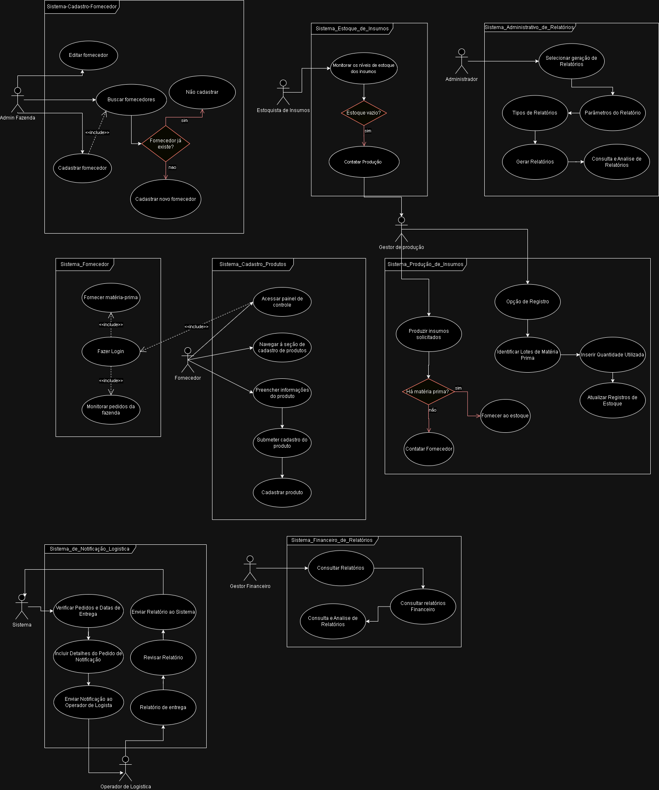

# Sprint 3

Durante a Sprint 3, nosso grupo focou em três principais atividades para o desenvolvimento do nosso projeto.

## Diagramas de Casos de Uso

Primeiramente, criamos os diagramas de casos de uso para o nosso software. Estes diagramas são representações visuais que mostram as diferentes maneiras como um usuário pode interagir com o nosso sistema. Cada caso de uso representa uma funcionalidade específica do sistema e mostra como os usuários e o sistema interagem para realizar uma ação.

## Identificação dos Atores do Software

Em seguida, identificamos os atores do nosso software. Os atores são as entidades que interagem com o sistema, que podem ser usuários humanos ou outros sistemas. Identificar os atores é um passo crucial no desenvolvimento do software, e nos ajudou a entender quem vai usar o sistema e quais são suas necessidades e expectativas.

## Design dos Protótipos de Interface

Finalmente, após a identificação dos atores e a criação dos diagramas de casos de uso, iniciamos o design dos protótipos de interface para o nosso software. Estes protótipos são esboços iniciais de como as telas do nosso sistema vão parecer, e nos ajudam a visualizar como o usuário vai interagir com o sistema ao ter seu fluxo de navegação definido neles.
