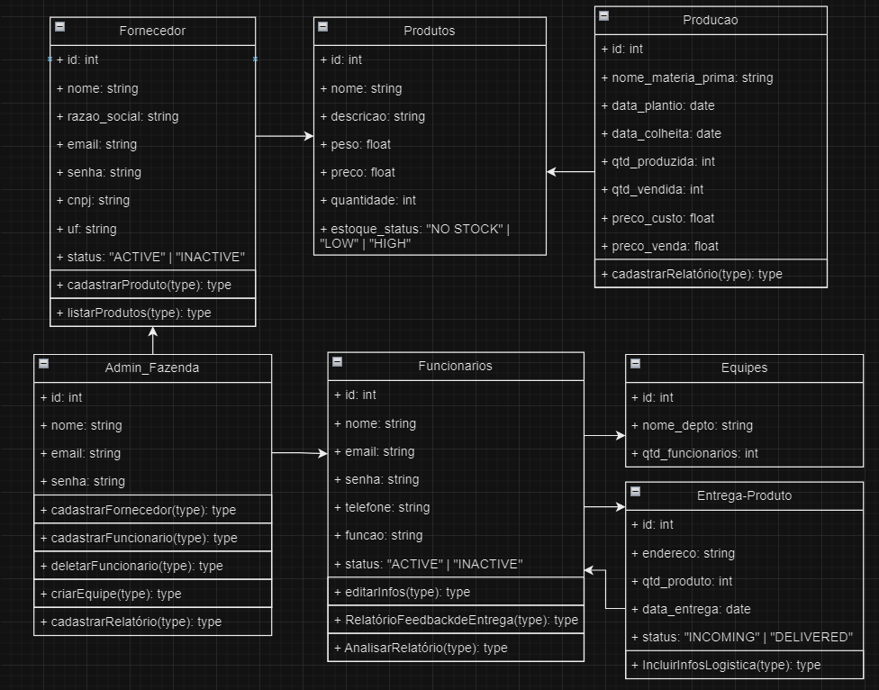

# Sprint 5

Durante a Sprint 5, nosso grupo focou no desenvolvimento de dois principais componentes do nosso projeto.

## Protótipo da Tela de Equipe da Fazenda Urbana

Primeiramente, trabalhamos na criação de um protótipo para a tela de equipe da fazenda urbana. Esta tela é uma parte crucial do nosso sistema, pois permite que os usuários visualizem e gerenciem as equipes responsáveis pela manutenção e operação das fazendas urbanas. O protótipo foi projetado para ser intuitivo e fácil de usar, permitindo que os usuários adicionem, removam ou alterem membros da equipe conforme necessário.

## Diagrama de Classes do Sistema

Em segundo lugar, desenvolvemos o diagrama de classes do nosso sistema. Este diagrama é uma representação visual da estrutura do nosso código, mostrando todas as classes, seus atributos, métodos e as relações entre elas. O diagrama de classes é uma ferramenta essencial para entender como o nosso sistema funciona e como as diferentes partes do código se relacionam entre si.

Estes foram os principais focos da nossa equipe durante a Sprint 5. Continuaremos a construir e aprimorar nosso sistema nas próximas sprints.

